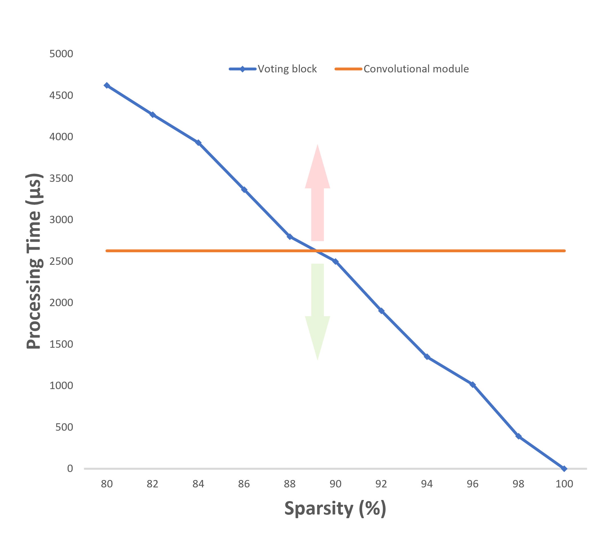
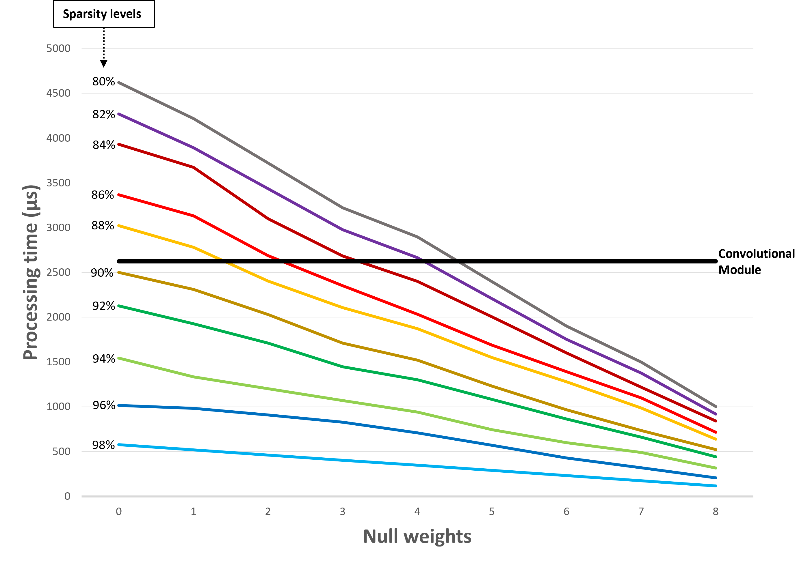

<h1> Voting convolution </h1>

 Hardware implementation of the voting scheme-based convolution. The proposed hardware design was empowered with the ability to detect the presence of null filter weights to discard unnecessary calculations and use stride to reduce the communication between components to the minimum necessary, leading to overall improvements of around 55% in processing time.

<h1 align="center">
    
</h1>

 Despite of beeing a sparse convolution, it is an operation mathematically equivalent to a dense convolution.

<h1 align="center">
    
</h1>

 Tests case for a convolution in dense data.

<h1 align="center">
    
</h1>

 Processing time comparasion with the dense convolution.

<h1 align="center">
    
</h1>

 Null weights effect on processing time.

<h1 align="center">
    
</h1>

 
<h4 align="center">
    Made with ❤ by pedromiguelcp. Project under development. 🖥⌨🖱

    Contact me.pedropereira@gmail.com for more information!
</h4>
